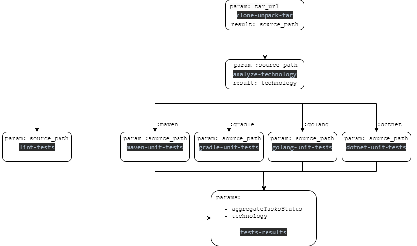

# Tekton Testing Pipeline Demo

### Logic:
1. Get the `tar.gz` file from `flux` git repo (supplied as an input).
2. Unzip `tar.gz`.
3. [parallel] Run unit-tests (supported frameworks: maven/gradle/go/.net-core)
4. [parallel] Run lint tests
5. **Fail** the pipline if any of the 2 steps fail, **Pass** if and only if both unit-Tests and Lint-Tests pass.

### Design:


### Prerequisites:
1. Install `flux` CLI:
```bash
curl -s https://fluxcd.io/install.sh | sudo bash 
```
2. Install `Tekton` pipelines:
```bash
kubectl apply -f https://storage.googleapis.com/tekton-releases/pipeline/latest/release.yaml

kubectl get pods --namespace tekton-pipelines --watch
```
2. Start a minikube cluster with a Container Networking Interface:
```bash
minikube start 
```

## Solution
### Step 1 - Configure `flux`

Bootstrap:
```bash
# Export flux token as an environment variable
export GITHUB_TOKEN=<your-token>
export GITHUB_USER=<your-username>

# Install Flux controller on the cluster
flux bootstrap github \
  --owner=$GITHUB_USER \
  --repository=tekton-testing-pipeline-demo \
  --branch=master \
  --path=flux \
  --read-write-key \
  --personal
```

### Step 2 - Deploy pipeline resources using `flux`
Now we need to copy the content of `flux/` folder into the git repo `flux` bootstrapped.
Because we bootstrapped this repo, we can just let `flux` reconcile znd do the work for us.

The repository's files' tree should look something like this:
```bash
tekton-testing-pipeline-demo/
  |
  |--- flux/
          |
          |--- flux-system/  # contains `flux` resources, createed at bootstrap.
          |--- source-repos/ # contains `flux` source git repos
          |--- tekton/       # contains `Tekton` resources for the testing pipeline
                |
                |--- pipelines/
                |--- tasks/
```
Trigger `flux` reconciliation:
```bash
# Reconcile
flux reconcile kustomization flux-system --with-source
```

Validate source repos are created:
```bash
flux get source git -A

# Validate the source code hosted .tar 
kubectl describe gitrepo <repo-name>

# For example
kubectl describe gitrepo golang-example-app
```

### Step 3 - Trigger a `PipelineRun`
```bash
kubectl create -f testing-pipeline-run.yaml

# Validate
tkn pipelinerun logs <pipelinerun-name> -f

# For example
tkn pipelinerun logs testing-pipeline-run-kg95d -f

# Check the pipeline related tasks
tkn pipeline describe testing-pipeline
```

### Step 4 - Run `Pipeline` for all application types
Change the `TAR_URL` param specified in the `testing-pipeline-run.yaml` file in order to create runs for other types of applications:
```yaml
  params:
    - name: TAR_URL
      value: http://source-controller.flux-system.svc.cluster.local./gitrepository/default/maven-example-app/latest.tar.gz
#    - name: TAR_URL
#      value:  http://source-controller.flux-system.svc.cluster.local./gitrepository/default/gradle-example-app/latest.tar.gz
#    - name: TAR_URL
#      value: http://source-controller.flux-system.svc.cluster.local./gitrepository/default/golang-example-app/latest.tar.gz
#    - name: TAR_URL
#      value: http://source-controller.flux-system.svc.cluster.local./gitrepository/default/dotnet-example-app/latest.tar.gz
```
Don't forget to trigger a run:
```bash
kubectl create -f testing-pipeline-run.yaml

# Validate
tkn pipelinerun logs <pipelinerun-name> -f

# For example
tkn pipelinerun logs testing-pipeline-run-49gr7 -f
```